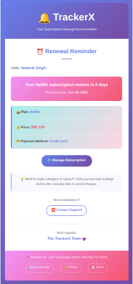

# 🚀 TrackerX : Subscription Tracker API

<div align="center">
  
  
  
  
  
  
  

  
  *This is a Subscription Tracker API featuring user authentication, subscription management, and automated email reminders*

</div>

---

## 📖 About This Project

I have built this REST API to help users manage their various subscriptions (Netflix, Spotify, etc.) with automated email reminders. The project demonstrates modern backend development practices including authentication, database design, workflow automation, and email services.

## ✨ Key Features

### 🔐 **User Authentication & Security**
- **JWT-based Authentication** - Secure token-based user sessions
- **Password Validation** - Custom validator ensuring strong passwords
- **Bcrypt Hashing** - Secure password encryption
- **Protected Routes** - Middleware-based route protection

### 📊 **Subscription Management**
- **CRUD Operations** - Complete Create, Read, Update, Delete functionality
- **User-Specific Data** - Users can only manage their own subscriptions
- **Auto-calculated Renewal Dates** - Smart date calculation based on frequency
- **Category Management** - Organize subscriptions by type
- **Status Tracking** - Active, cancelled, and expired subscription states

### 📧 **Automated Email Workflows**
- **Smart Reminder System** - Automated emails at 8, 4, 2, and 1 days before renewal
- **Beautiful Email Templates** - Modern, responsive HTML email design
- **Workflow Management** - Powered by Upstash QStash for reliable delivery
- **Email Scheduling** - Intelligent timing based on renewal dates

### 🛡️ **Data Validation & Error Handling**
- **Mongoose Schema Validation** - Database-level data integrity
- **Custom Validators** - Business logic validation
- **Global Error Handling** - Centralized error management
- **Input Sanitization** - Protection against malicious input

## 🛠️ Tech Stack

### **Backend Framework**
- **Node.js** - JavaScript runtime environment
- **Express.js** - Web application framework
- **ES6 Modules** - Modern JavaScript module system

### **Database & ODM**
- **MongoDB** - NoSQL document database
- **Mongoose** - Object Document Mapper for MongoDB

### **Authentication & Security**
- **JSON Web Tokens (JWT)** - Stateless authentication
- **bcryptjs** - Password hashing library
- **Custom Middleware** - Route protection and validation

### **Email & Workflows**
- **Nodemailer** - Email sending service
- **Upstash QStash** - Serverless workflow automation
- **Upstash Workflows** - Advanced scheduling and retry logic
- **dayjs** - Date manipulation and formatting

### **Development Tools**
- **ESLint** - Code linting and style enforcement
- **Nodemon** - Development server with hot reload
- **dotenv** - Environment variable management


## 🔄 Workflow Architecture

The automated email reminder system follows this sophisticated workflow:

### **Workflow Process**

1. **Triggering the Workflow**  
   - The workflow begins whenever a user creates or submits a new subscription.  
   - The created subscription ID is passed to the workflow.

2. **Retrieving Subscription Details**  
   - The process extracts the **subscription ID** from the context.  
   - It then searches for the corresponding subscription in the database.

3. **Validation Checks**  
   - If the subscription does not exist:  
     - An error is logged.  
     - The process terminates.  
   - If the subscription exists, its status is checked:  
     - If inactive:  
       - The status is logged.  
       - The process exits.  
     - If active, the renewal date is verified.

4. **Renewal Date Evaluation**  
   - If the renewal date has passed:  
     - This information is logged.  
     - The process exits.  
   - If the renewal date is in the future, the reminder loop begins.

5. **Reminder Scheduling**  
   - For each predefined reminder:  
     - The reminder date is calculated.  
     - If the reminder date is in the future, the system waits until that time.  
     - Once the reminder date arrives (or if it has already passed), the reminder email is sent.

6. **Completion**  
   - The process repeats for all reminders in the list.  
   - After processing all reminders, the workflow concludes.

## 📧 Email Template Preview

The system sends beautiful, responsive HTML emails that look like this:

<div align="center">
  
  
  
</div>


## 🚀 API Endpoints

### **Authentication**
```http
POST /api/v0/auth/sign-up      # User registration
POST /api/v0/auth/sign-in      # User login
POST /api/v0/auth/sign-out     # User logout
```

### **User Management**
```http
GET  /api/v0/users             # Get all users (protected)
GET  /api/v0/users/:id         # Get user by ID 
```

### **Subscription Management**
```http
GET    /api/v0/subscriptions           # Get all subscriptions
GET    /api/v0/subscriptions/:id       # Get subscription by ID
POST   /api/v0/subscriptions           # Create subscription (protected)
PUT    /api/v0/subscriptions/:id       # Update subscription (protected)
DELETE /api/v0/subscriptions/:id       # Delete subscription (protected)
PUT    /api/v0/subscriptions/:id/cancel # Cancel subscription (protected)
GET    /api/v0/subscriptions/user/:id  # Get user's subscriptions (protected)
```

### **Workflows**
```http
POST /api/v0/workflows/subscription/reminder  # Trigger email workflow
```

## 🏃‍♂️ Getting Started

### **Prerequisites**
- Node.js (v18 or higher)
- MongoDB database
- Gmail account for email service

### **Installation**

1. **Clone the repository**
   ```bash
   git clone https://github.com/yourusername/subscription-tracker-api.git
   cd subscription-tracker-api
   ```

2. **Install dependencies**
   ```bash
   npm install
   ```

3. **Environment Setup**
   
   Create `.env.development.local` file:
   ```env
   PORT=4500
   SERVER_URL="http://localhost:4500"
   NODE_ENV=development
   
   # Database
   DB_URI=your_mongodb_connection_string
   
   # JWT
   JWT_SECRET="your_jwt_secret"
   JWT_EXPIRES_IN="2d"
   
   # QStash (Upstash)
   QSTASH_URL="http://localhost:8080"
   QSTASH_TOKEN="your_qstash_token"
   
   # Email
   EMAIL_PASSWORD="your_gmail_app_password"
   ```

4. **Start the services**
   
   Terminal 1 - Start QStash (for workflows):
   ```bash
   npx @upstash/qstash-cli dev --port 8080
   ```
   
   Terminal 2 - Start the API:
   ```bash
   npm run dev
   ```

### **Usage Example**

1. **Register a new user:**
   ```bash
   curl -X POST http://localhost:4500/api/v0/auth/sign-up \
     -H "Content-Type: application/json" \
     -d '{
       "name": "John Doe",
       "email": "john@example.com", 
       "password": "password123"
     }'
   ```

2. **Create a subscription:**
   ```bash
   curl -X POST http://localhost:4500/api/v0/subscriptions \
     -H "Content-Type: application/json" \
     -H "Authorization: Bearer YOUR_JWT_TOKEN" \
     -d '{
       "name": "Netflix",
       "price": 649,
       "currency": "INR",
       "frequency": "monthly",
       "category": "entertainment",
       "paymentMethod": "Credit Card",
       "startDate": "2025-06-28",
        "renewalDate":"2025-06-27"
     }'
   ```


<div align="center">


</div>
